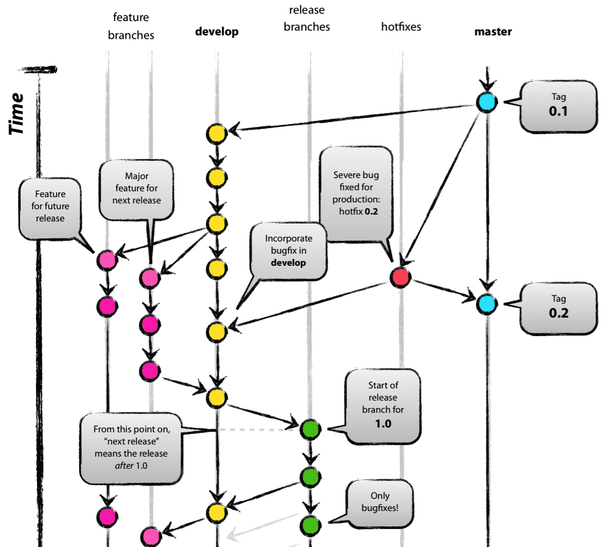
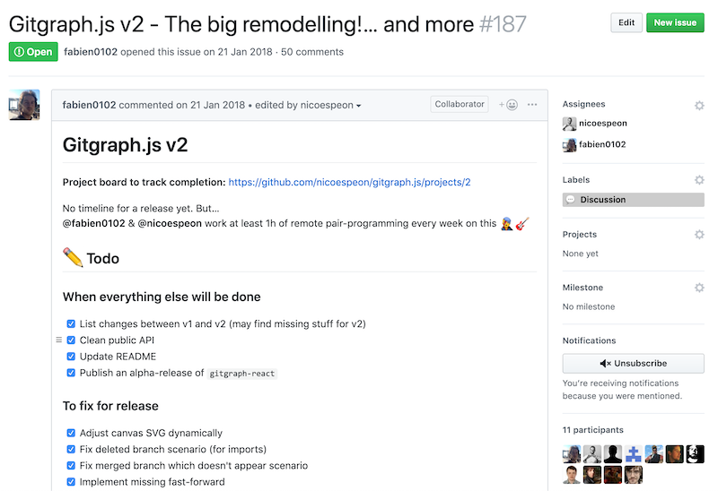
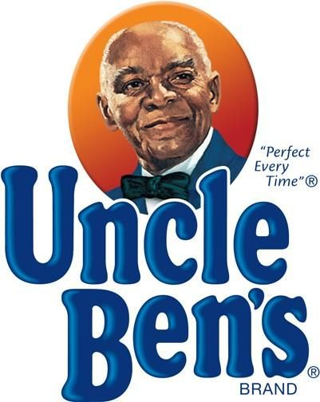
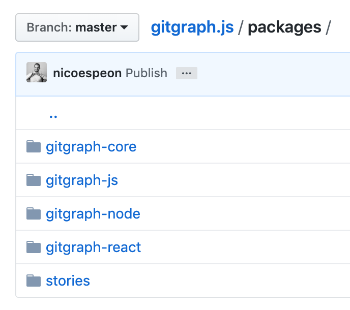
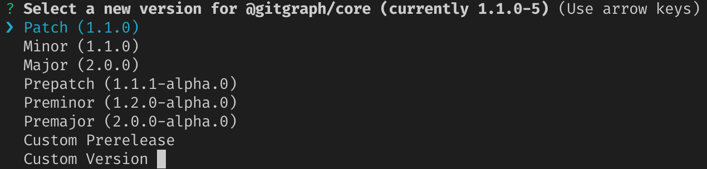
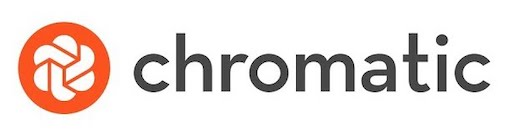

import { Image, Appear, Head } from "mdx-deck";
import { Invert, Split, SplitRight } from "mdx-deck/layouts";
export { theme } from "./theme";
import KeyIdea from "./KeyIdeaLayout";
import Todo from "./TodoLayout";

<Head>
  <title>Drawing Git Graphs in the Browser</title>
  <meta
    name="twitter:card"
    content="https://www.nicoespeon.com/talk-drawing-git-graphs/images/0-cover.png"
  />
  <meta name="twitter:site" content="@nicoespeon" />
  <meta name="twitter:title" content="Drawing Git Graphs in the Browser" />
  <meta
    name="twitter:description"
    content="How I came to build Gitgraph.js. A talk about git, JS/React, open-source and side-projects in general."
  />
  <meta
    name="twitter:image"
    content="https://www.nicoespeon.com/talk-drawing-git-graphs/images/12-gitgraph-stories.png"
  />
  <meta
    name="og:image"
    content="https://www.nicoespeon.com/talk-drawing-git-graphs/images/12-gitgraph-stories.png"
  />
</Head>

<Image src="./images/0-cover.png" size={"contain"} />;

---

export default Split;


# Nicolas Carlo

## _@nicoespeon_


<!-- ---

export default Split;


## 80 countries

 -->

---

export default Invert;

# Drawing Git Graphs<br />in the Browser

---

## This is the story of a problem I had

---

<Image src="./images/1-us.jpg" />

---

export default Split;


---


## We were teaching git to engineers

<!-- ---

# The problem I had

Drawing git graphs in slides are a pain in the ass! 😭 -->

---

export default Split;



## 😍

Source: [nvie.com](https://nvie.com/posts/a-successful-git-branching-model/)

<Appear>
  <p>
    But it's <u>painful</u> to maintain
  </p>
</Appear>

---

## _"I wish we would a JS library to draw git graphs in the browser!"_ — Nicolas 🏖

---

## _"Hold my beer!"_ — Fabien 🍺

---

export default KeyIdea;

## You can **hack** your own problems!

When you have a crazy idea in mind, <u>do it</u>

---

export default Invert;

# Gitgraph.js v1

---

<iframe src="https://gitgraphjs.com/v1/" />

---

# v1 was awesome 🌈

- solved our problem
- highly customizable
- no dependency, 6.3kB gzipped
- we had fun 🎷

<!-- ---

# We learned crazy stuff

[json2tsd](https://github.com/nicoespeon/gitgraph.js/blob/gitgraph.js/scripts/json2tsd.test.js) > generate TS types from code docs -->

<!-- ---

export default Invert;

# Then, you have to maintain -->

<!-- ---

export default Invert;

<Image src="./images/5-metidia.jpg" size={"contain"} /> -->

---

## 🤔

- How do you deal with issues? With PRs?
- Modelling made some features hard to implement
- No test. How to test a rendering lib?

---

export default KeyIdea;

## Hack your way out of your problem

An _OK execution_ is better than a _perfect idea_

---

## But, still… We want:

- tests
- better separation of responsibilities
- types & modern tooling

---

export default Invert;

# Time for v2

<!-- ---

## What would be different

- distinct the rendering from the calculation (core)
- TDD the core!
- modularity & types with TypeScript -->

---

## 👷 New architecture

```
              +----------------+
         +----| @gitgraph/core |-----+
         |    +----------------+     |
         v                           v
+-----------------+           +--------------+
| @gitgraph/react |           | @gitgraph/js |
+-----------------+           +--------------+
```

---

## 🇨🇦 <-> 🇩🇪

**Weekly remote pair-programming!**

---

### 🏗 We built v2 over 1 year



---

export default Invert;

# What I learnt in the process

---

## 💬 Pair-programming eases communication


---

## Our weekly session

- 15min of _"how are you doing dude?!"_
- 5min of _"here's the next challenge to solve"_
- 40min of achieving the challenge

---

export default Split;



## Our recipe (TDD)

1. Write a failing test
1. Write the <u>simplest</u> code to make the test pass
1. Refactor the code

---

## ✅ Types are super-helpful

---

## 🤖 Automate the non-important stuff

Formatting is for Prettier. Stop wasting time.

---

export default Split;


## Simplifies packages management

Monorepo ≠ Monolith

---



---

`lerna bootstrap | publish | …`



---

<Image src="./images/9-gitgraph-react.png" size={"contain"} />

---

## 🛣 `git worktree`

- Checkout more than one branch at a time
- Synced to the same git repository

---

<Image src="./images/10-git-worktree.png" size={"contain"} />

---

### `git commit --allow-empty`

👌 simulate commits without bothering with changes

---


## Useful to trigger the CI

---


&nbsp;


E2E tests of rendering libs in **Storybook**

Visual regression test with **Chromatic QA**

---

<Image src="./images/12-gitgraph-stories.png" size={"contain"} />

---

<Image src="./images/12-chromatic-workflow.png" size={"contain"} />

---

<Image src="./images/12-chromatic-changes.png" size={"contain"} />

---

<Image src="./images/12-chromatic-diff.png" size={"contain"} />

---

<Image src="./images/12-chromatic-pr.png" size={"contain"} />

<!-- ---

export default Split;


Learning is a journey, not a destination -->

---

export default KeyIdea;

## Don't wait, **hack** your own problems!

You will learn <u>a lot</u> in the process

---

export default Invert;

# v2 is out!

---

## 💁‍ What's in there

- 2 SVG rendering libs: _@gitgraph/js_ & _@gitgraph/react_
- Give you a git-like API
- Types, tests & stories
- Experimental **import()** function

---

import PlaygroundV2 from "./components/PlaygroundV2";

# <PlaygroundV2 />

---

export default KeyIdea;

## You have an idea in mind?

Just do it. It doesn't have to be perfect.

---

[github.com/nicoespeon/gitgraph.js/](https://github.com/nicoespeon/gitgraph.js/)

# 🙏 Thank you

🎤 soonly available at [bit.ly/skillscasts-nyc-2019](https://bit.ly/skillscasts-nyc-2019)
